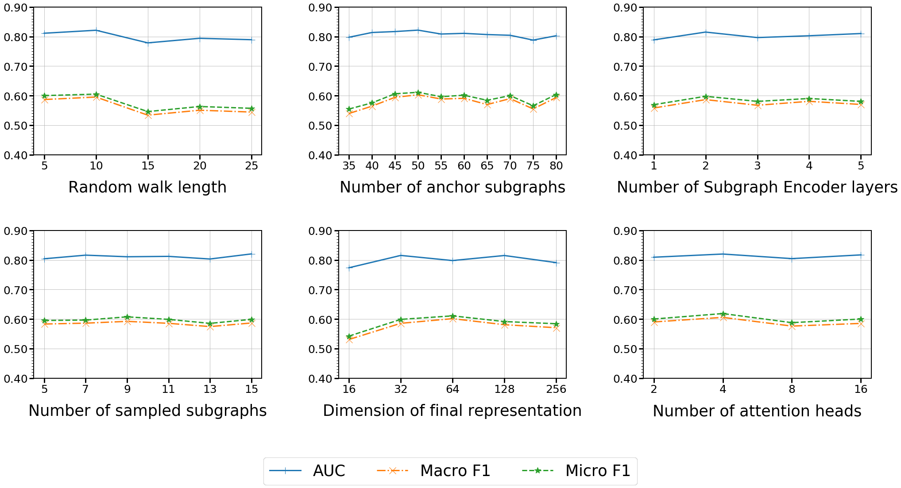

# DyHNet: Learning Dynamic Heterogeneous Network Representations


## 1. Directory structure:

```
.
|   README.md
|   environment.yml
|
|--- dataset
|--- model
|--- ouput
|--- dedenpencies
|   |-- littleballoffur: module for graph sampling
|   |-- prepare_data: module for data preprocessing
|
|--- DyHNet
|   DyHNet.py: main pipeline object
|   main.py: main file
|   |-- config
|   |   dblp.json
|   |   dblp_four_area.json
|   |   imdb.json
|   |   yelp.json
|   |-- src
|   |   datasets.py: data module for training
|   |   model.py: model module for training
|   |   trainer.py: trainer module for training
|   |   inference.py: inference agent
|   |   evaluation: evaluation module
|   |   utils.py: utils functions
```

## 2. Installation

### 2.1 Libraries

To install all neccessary libraries, please run:

```bash
conda env create -f environment.yml
```

In case, the version of Pytorch and Cuda are not compatible on your machine, please remove all related lib in the `.yml` file; then install Pytorch and Pytorch Geometric separately. If you want to create an environment without using existing file, please refer to `installation.md` file. 


### 2.2 PyTorch
Please follow Pytorch installation instruction in this [link](https://pytorch.org/get-started/locally/).


### 2.3 Torch Geometric
```bash
pip install torch-scatter -f https://data.pyg.org/whl/torch-${TORCH}+${CUDA}.html
pip install torch-sparse -f https://data.pyg.org/whl/torch-${TORCH}+${CUDA}.html
pip install torch-cluster -f https://data.pyg.org/whl/torch-${TORCH}+${CUDA}.html
pip install torch-spline-conv -f https://data.pyg.org/whl/torch-${TORCH}+${CUDA}.html
pip install torch-geometric
```
where `${TORCH}` and `${CUDA}` is version of Pytorch and Cuda.


## 3. Model Architecture


## 4. Experimental results

### 4.1 Link prediction
**IMDB**

| **Model**           | **AUC**    | **F1 (k=1)**     | **Recall (k=1)** | **Precision (k=1)** | **F1 (k=2)** | **Recall (k=2)** | **Precision (k=2)** |
| --------------- | ------ | ------ | ------ | --------------- | ------ | ------ | ------ |
| DynAE           | 0.5156 | 0.3705 | 0.3344 | 0.4154 | 0.5141 | 0.6709 | 0.4167 |
| DynAERNN        | 0.5014 | 0.3647 | 0.3291 | 0.4089 | 0.5100 | 0.6656 | 0.4134 |
| DynGEM          | 0.5829 | 0.4367 | 0.3941 | 0.4896 | 0.5494 | 0.7170 | 0.4453 |
| DySAT           | 0.5087 | 0.3717 | 0.3354 | 0.4167 | 0.5052 | 0.6593 | 0.4095 |
| VGRNN           | 0.5534 | 0.3949 | 0.3564 | 0.4427 | 0.5084 | 0.6635 | 0.4121 |
| EvolveGCN       | 0.5586 | 0.3717 | 0.3354 | 0.4167 | 0.5133 | 0.6698 | 0.4160 |
| CTGCN-C         | <u>0.6169 </u>| <u>0.4448</u> | <u>0.4015</u> | <u>0.4987</u> | <u>0.5590</u> | <u>0.7296 </u>| <u>0.4531 </u>|
| DHNE            | 0.5102 | 0.3577 | 0.3229 | 0.4010 | 0.5116 | 0.6677 | 0.4147 |
| DyHATR          | 0.5216 | 0.3438 | 0.3103 | 0.3854 | 0.4956 | 0.6468 | 0.4017 |
| DyHNet          | **0.6588** | **0.5029** | **0.4539** | **0.5638** | **0.5831** | **0.7610** | **0.4727** |
| _% over the best_ | _6.79%_  | _13.05%_ | _13.05%_ | _13.05%_ | _4.31%_ | _4.31%_ | _4.31%_ |


**AMiner**

| **Model**           | **AUC**    | **F1 (k=1)**     | **Recall (k=1)** | **Precision (k=1)** | **F1 (k=2)** | **Recall (k=2)** | **Precision (k=2)** |
| --------------- | ------ | ------ | ------ | --------------- | ------ | ------ | ------ 
| DynAE           | 0.5337  | 0.1848 | 0.1568 | 0.2250 | 0.2708 | 0.3241 | 0.2325 |
| DynAERNN        | 0.5883  | 0.1972 | 0.1673 | 0.2401 | 0.2708 | 0.3241 | 0.2325 |
| DynGEM          | 0.5294  | 0.2609 | 0.2213 | 0.3176 | 0.3786 | 0.4532 | 0.3251 |
| DySAT           | 0.5138  | 0.2624 | 0.2227 | 0.3195 | 0.3368 | 0.4032 | 0.2892 |
| VGRNN           | 0.5817  | 0.2686 | 0.2279 | 0.3270 | 0.3060 | 0.3663 | 0.2628 |
| EvolveGCN       | <u>0.5982</u>  | 0.2034 | 0.1726 | 0.2476 | 0.2829 | 0.3386 | 0.2429 |
| CTGCN-C         | 0.5511  | 0.2360 | 0.2003 | 0.2873 | 0.3247 | 0.3887 | 0.2788 |
| DHNE            | 0.5048  | 0.2407 | 0.2042 | 0.2930 | 0.3434 | 0.4111 | 0.2949 |
| DyHATR          | 0.5111  | <u>0.2866</u> | <u>0.2431</u> | <u>0.3491</u> | <u>0.3788</u> | <u>0.4531</u> | <u>0.3254</u> |
| DyHNet          | **0.5742**  | **0.3307** | **0.2806** | **0.4026** | **0.4260** | **0.5099** | **0.3658** |
| _% over the best_ | _\-4.02%_ | _15.40%_ | _15.46%_ | _15.32%_ | _12.46%_ | _12.50%_ | _12.41%_ |

**DBLP**
| **Model**           | **AUC**    | **F1 (k=1)**     | **Recall (k=1)** | **Precision (k=1)** | **F1 (k=2)** | **Recall (k=2)** | **Precision (k=2)** |
| --------------- | ------ | ------ | ------ | --------------- | ------ | ------ | ------ 
| DynAE           | 0.6481 | 0.0333 | 0.0328 | 0.0338 | 0.2602 | 0.3829 | 0.1971 |
| DynAERNN        | <u>0.6606</u> | 0.2968 | 0.2925 | 0.3012 | 0.2052 | 0.3019 | 0.1554 |
| DynGEM          | 0.6492 | 0.0136 | 0.0134 | 0.0138 | 0.2056 | 0.3025 | 0.1558 |
| DySAT           | 0.5000 | 0.2499 | 0.2463 | 0.2536 | 0.2543 | 0.3742 | 0.1926 |
| EvolveGCN       | 0.5239 | 0.0095 | 0.0094 | 0.0096 | 0.0287 | 0.0422 | 0.0217 |
| CTGCN-C         | 0.5994 | 0.1759 | 0.1734 | 0.1785 | 0.2025 | 0.2979 | 0.1533 |
| DHNE            | 0.5057 | 0.2146 | 0.2115 | 0.2178 | 0.2739 | 0.4029 | 0.2074 |
| DyHATR          | 0.5178 | <u>0.3552</u> | <u>0.3501</u> | <u>0.3604</u> | <u>0.4404</u> | <u>0.6479</u> | <u>0.3336</u> |
| DyHNet          | **0.6824** | **0.3701** | **0.3648** | **0.3756** | **0.4609** | **0.6780** | **0.3491** |
|_% over the best_ | _3.29%_  | _4.21%_  | _4.21%_  | _4.21%_ | _4.65%_ | _4.65%_ | _4.65%_ |

**Yelp**
| **Model**           | **AUC**    | **F1 (k=1)**     | **Recall (k=1)** | **Precision (k=1)** | **F1 (k=2)** | **Recall (k=2)** | **Precision (k=2)** |
| --------------- | ------ | ------ | ------ | --------------- | ------ | ------ | ------ 
| DynAE           | 0.5221 | 0.0091	| 0.0206 | 0.0058 | 0.0095 | 0.0382	| 0.0054 |
| DynAERNN        | 0.5128 | 0.0011	| 0.0025 | 0.0007 | 0.0021 | 0.0083	| 0.0012 |
| DynGEM          | <0.6849</u> | <u>0.0220</u>	| <u>0.0499</u> | <u>0.0141</u> | <u>0.0220</u> | <u>0.0886</u>	| <u>0.0125</u> |
| DySAT           | 0.5024 | 0.0048	| 0.0108 | 0.0030 | 0.0043 | 0.0172	| 0.0024 |
| EvolveGCN       | 0.5393 | 0.0174	| 0.0394 | 0.0112 | 0.0152 | 0.0613	| 0.0087 |
| CTGCN-C         | 0.6366 | 0.0137	| 0.0311 | 0.0088 | 0.0134 | 0.0539	| 0.0076 |
| DHNE            | 0.5027 | 0.0027	| 0.0062 | 0.0017 | 0.0033 | 0.0132	| 0.0019 |
| DyHATR          | 0.5124 | 0.0052	| 0.0117 | 0.0033 | 0.0058 | 0.0234	| 0.0033 |
| DyHNet          | **0.6715** | **0.0235**	| **0.0534** | **0.0151** | **0.0247** | **0.0986**	| **0.0141** |
|_% over the best_ | _-1.96%_  | _7.02%_  | _7.06%_  | _7.01%_ | _12.26%_ | _11.23%_ | _12.40%_ |

### 4.2 Node classification
<table>
    <tr>
        <td>Datasets</td>
        <td>Metrics</td>
        <td>Train %</td>
        <td>DynAE</td>
        <td>DynAERNN</td>
        <td>DynGEM</td>
        <td>DySAT</td>
        <td>EvolveGCN</td>
        <td>CTGCN-C</td>
        <td>DHNE</td>
        <td>DyHATR</td>
        <td>DyHNet</td>
        <td>% over the best</td>
    </tr>
    <tr>
        <td rowspan=12>Yelp</td>
        <td rowspan=4>AUC</td>
        <td>20%</td>
        <td>0.5319</td>
        <td>0.5040</td>
        <td>0.5756</td>
        <td>0.4947</td>
        <td>0.6273</td>
        <td>0.6368</td>
        <td>0.5001</td>
        <td>0.6037</td>
        <td>0.6965</td>
        <td>9.38%</td>
    </tr>
    <tr>
        <td>40%</td>
        <td>0.5498</td>
        <td>0.5109</td>
        <td>0.6040</td>
        <td>0.5076</td>
        <td>0.6245</td>
        <td>0.6690</td>
        <td>0.4986</td>
        <td>0.6201</td>
        <td>0.7021</td>
        <td>4.94%</td>
    </tr>
    <tr>
        <td>60%</td>
        <td>0.5503</td>
        <td>0.5089</td>
        <td>0.6043</td>
        <td>0.5043</td>
        <td>0.6304</td>
        <td>0.6697</td>
        <td>0.4890</td>
        <td>0.6142</td>
        <td>0.6963</td>
        <td>3.97%</td>
    </tr>
    <tr>
        <td>80%</td>
        <td>0.5643</td>
        <td>0.5205</td>
        <td>0.6097</td>
        <td>0.4970</td>
        <td>0.6311</td>
        <td>0.6673</td>
        <td>0.4898</td>
        <td>0.6225</td>
        <td>0.7147</td>
        <td>7.11%</td>
    </tr>
    <tr>
        <td rowspan=4>Macro F1</td>
        <td>20%</td>
        <td>0.1741</td>
        <td>0.2845</td>
        <td>0.3455</td>
        <td>0.2589</td>
        <td>0.1741</td>
        <td>0.4414</td>
        <td>0.1759</td>
        <td>0.3983</td>
        <td>0.4871</td>
        <td>10.37%</td>
    </tr>
    <tr>
        <td>40%</td>
        <td>0.1791</td>
        <td>0.2215</td>
        <td>0.4088</td>
        <td>0.2672</td>
        <td>0.1791</td>
        <td>0.4854</td>
        <td>0.1791</td>
        <td>0.4056</td>
        <td>0.5035</td>
        <td>3.74%</td>
    </tr>
    <tr>
        <td>60%</td>
        <td>0.1771</td>
        <td>0.1771</td>
        <td>0.3996</td>
        <td>0.2783</td>
        <td>0.1771</td>
        <td>0.4671</td>
        <td>0.1771</td>
        <td>0.4043</td>
        <td>0.4917</td>
        <td>5.25%</td>
    </tr>
    <tr>
        <td>80%</td>
        <td>0.1817</td>
        <td>0.2878</td>
        <td>0.4054</td>
        <td>0.2657</td>
        <td>0.1738</td>
        <td>0.4579</td>
        <td>0.1817</td>
        <td>0.4194</td>
        <td>0.5123</td>
        <td>11.87%</td>
    </tr>
    <tr>
        <td rowspan=4>Micro F1</td>
        <td>20%</td>
        <td>0.3534</td>
        <td>0.3687</td>
        <td>0.3956</td>
        <td>0.3442</td>
        <td>0.3534</td>
        <td>0.4351</td>
        <td>0.3544</td>
        <td>0.4082</td>
        <td>0.4882</td>
        <td>12.21%</td>
    </tr>
    <tr>
        <td>40%</td>
        <td>0.3673</td>
        <td>0.3704</td>
        <td>0.4224</td>
        <td>0.3587</td>
        <td>0.3673</td>
        <td>0.4774</td>
        <td>0.3673</td>
        <td>0.4088</td>
        <td>0.5090</td>
        <td>6.61%</td>
    </tr>
    <tr>
        <td>60%</td>
        <td>0.3618</td>
        <td>0.3618</td>
        <td>0.4128</td>
        <td>0.3673</td>
        <td>0.3618</td>
        <td>0.4592</td>
        <td>0.3618</td>
        <td>0.4091</td>
        <td>0.4944</td>
        <td>7.68%</td>
    </tr>
    <tr>
        <td>80%</td>
        <td>0.3748</td>
        <td>0.3748</td>
        <td>0.4119</td>
        <td>0.3636</td>
        <td>0.3525</td>
        <td>0.4527</td>
        <td>0.3748</td>
        <td>0.4193</td>
        <td>0.5121</td>
        <td>13.11%</td>
    </tr>
    <tr>
        <td rowspan=12>DBLP four area</td>
        <td rowspan=4>AUC</td>
        <td>20%</td>
        <td>0.5828</td>
        <td>0.5880</td>
        <td>0.6263</td>
        <td>0.5030</td>
        <td>0.5056</td>
        <td>0.7152</td>
        <td>0.4895</td>
        <td>0.6301</td>
        <td>0.7304</td>
        <td>2.14%</td>
    </tr>
    <tr>
        <td>40%</td>
        <td>0.5860</td>
        <td>0.5919</td>
        <td>0.6347</td>
        <td>0.5078</td>
        <td>0.5002</td>
        <td>0.7387</td>
        <td>0.4924</td>
        <td>0.6393</td>
        <td>0.7565</td>
        <td>2.42%</td>
    </tr>
    <tr>
        <td>60%</td>
        <td>0.5875</td>
        <td>0.5942</td>
        <td>0.6375</td>
        <td>0.5130</td>
        <td>0.5193</td>
        <td>0.7481</td>
        <td>0.5072</td>
        <td>0.6410</td>
        <td>0.7797</td>
        <td>4.22%</td>
    </tr>
    <tr>
        <td>80%</td>
        <td>0.5799</td>
        <td>0.5906</td>
        <td>0.6294</td>
        <td>0.4996</td>
        <td>0.5044</td>
        <td>0.7529</td>
        <td>0.5067</td>
        <td>0.6366</td>
        <td>0.8098</td>
        <td>7.55%</td>
    </tr>
    <tr>
        <td rowspan=4>Macro F1</td>
        <td>20%</td>
        <td>0.2348</td>
        <td>0.2348</td>
        <td>0.2966</td>
        <td>0.1849</td>
        <td>0.1362</td>
        <td>0.4341</td>
        <td>0.1023</td>
        <td>0.2736</td>
        <td>0.4488</td>
        <td>3.39%</td>
    </tr>
    <tr>
        <td>40%</td>
        <td>0.2547</td>
        <td>0.2661</td>
        <td>0.3482</td>
        <td>0.1925</td>
        <td>0.1357</td>
        <td>0.4693</td>
        <td>0.1009</td>
        <td>0.2913</td>
        <td>0.5107</td>
        <td>8.82%</td>
    </tr>
    <tr>
        <td>60%</td>
        <td>0.2499</td>
        <td>0.2499</td>
        <td>0.3400</td>
        <td>0.1874</td>
        <td>0.1348</td>
        <td>0.4780</td>
        <td>0.1704</td>
        <td>0.2734</td>
        <td>0.5362</td>
        <td>12.16%</td>
    </tr>
    <tr>
        <td>80%</td>
        <td>0.2322</td>
        <td>0.2322</td>
        <td>0.3214</td>
        <td>0.1793</td>
        <td>0.1427</td>
        <td>0.4895</td>
        <td>0.1252</td>
        <td>0.2528</td>
        <td>0.5785</td>
        <td>18.16%</td>
    </tr>
    <tr>
        <td rowspan=4>Micro F1</td>
        <td>20%</td>
        <td>0.3012</td>
        <td>0.3012</td>
        <td>0.3218</td>
        <td>0.2907</td>
        <td>0.2849</td>
        <td>0.4469</td>
        <td>0.2571</td>
        <td>0.3348</td>
        <td>0.4632</td>
        <td>3.65%</td>
    </tr>
    <tr>
        <td>40%</td>
        <td>0.3194</td>
        <td>0.3175</td>
        <td>0.3614</td>
        <td>0.2965</td>
        <td>0.2895</td>
        <td>0.4842</td>
        <td>0.2527</td>
        <td>0.3561</td>
        <td>0.5212</td>
        <td>7.63%</td>
    </tr>
    <tr>
        <td>60%</td>
        <td>0.3165</td>
        <td>0.3165</td>
        <td>0.3510</td>
        <td>0.2931</td>
        <td>0.2888</td>
        <td>0.4951</td>
        <td>0.2802</td>
        <td>0.3393</td>
        <td>0.5468</td>
        <td>10.45%</td>
    </tr>
    <tr>
        <td>80%</td>
        <td>0.2945</td>
        <td>0.2945</td>
        <td>0.3321</td>
        <td>0.2878</td>
        <td>0.3149</td>
        <td>0.5031</td>
        <td>0.2270</td>
        <td>0.3161</td>
        <td>0.5916</td>
        <td>17.60%</td>
    </tr>
</table>
<!-- ### 4.3 Ablation study

### 4.4 Sensitivity analysis -->

<!-- <p align="center">
  
&nbsp; &nbsp; &nbsp; &nbsp;
  
</p> -->
 <!-- **Sensitivity for link prediction on IMDB and AMiner**

<table><tr>
<td> 
  <p align="center" style="padding: 10px">
    
    <br>
    <em style="color: grey">IMDB</em>
  </p> 
</td>
<td> 
  <p align="center">
    
    <br>
    <em style="color: grey">AMiner</em>
  </p> 
</td>
</tr></table>

**Sensitivity for node classification on DBLP and Yelp**

<table><tr>
<td> 
  <p align="center" style="padding: 10px">
    
    <br>
    <em style="color: grey">DBLP</em>
  </p> 
</td>
<td> 
  <p align="center">
    
    <br>
    <em style="color: grey">Yelp</em>
  </p> 
</td>
</tr></table> -->

## 5. Experimental replication

### 5.1 Dataset
To use your own dataset, you need to prepare:

- One config file with json format named `data_name.json` and put it in `DyHNet/config`
- Four input files put under the folder `dataset/data_name`.

    1. node_types.csv: format of each row `node_id (int), node_type (int), node_type_name (str)`

        ```
        node_id,node_type,node_type_name
        0,0,author
        1,0,author
        2,0,author
        3,0,author
        4,0,author
        ```
    
    2. temporal_edge_list.txt: format of each row `source_node_id (int), target_node_id (int), time_id (int)`

        ```
        1840 1 6
        1840 2 6
        1840 3 6
        1841 4 4
        1841 5 4
        ```

    3. temporal_subgraphs.pth: format of each row `subgraph_ids, time_id, label`. The label column can be null if you don't have the label for the subgraph. In our experiment, we use this column as a meta data for constructing the input data 4 (data.pkl)
    
        ```
        1883-90-105-12693-12812-13117-13235-13273-13682-14027-14158-14241-14387-14517	0	uai	
        1884-105-121-12736-12827-13072-13329-14517	0	uai	
        1909-182-183-12636-12640-12749-12776-12782-12807-13039-13040-13124-13676-14308-14410-14489-14519	0	cikm	
        1930-242-243-13072-13228-13702-14073-14089-14311-14519	0	cikm	
        1972-346-347-12578-12693-12893-13437-13473-13595-13740-14421-14523	0	colt	
        ```

    4. data.pkl: a dictionary for train/val/test dataloader
    
        ```
        data = {0: {
        'node_id': 800,
        'subgraph_idx': {0: [1, 2], 1: [4, 10], 2: [], 3: [8], 4: [99, 100, 101], 5: [7]},
        'label': 'kdd',
        'dataset': 'train',
        'time_id': 3,
        },
        }
        ```


### 5.2 Usage
- General usage:

```python
from DyHNet.DyHNet import *
config_path = './DyHNet/config/imdb.json'
dyhnet = DyHNet(config_path=config_path)

# Run full pipeline
dyhnet.run_pipeline()

# Run single step
## Preprocess data
dyhnet.preprocess_data()

## Initialize data, model, trainer
data_module, model_module, trainer = dyhnet.initialize()

## Train
dyhnet.train(data_module, model_module, trainer)

## Test with all checkpoints
checkpoint_paths = dyhnet.get_checkpoint_paths()
for checkpoint_path in checkpoint_paths:
    dyhnet.test(data_module, model_module, trainer, checkpoint_path)

## Infer with the last checkpoints
checkpoint_paths = dyhnet.get_checkpoint_paths()
dyhnet.generate_embedding(data_module, model_module, checkpoint_path=checkpoint_paths[-1])
```

- Detail usage:
    + For preprocessing data: refer to `DyHNet/prepare_data.py`
    + For training model: refer to `DyHNet/train.py`
    + For generating graph embedding: refer to `DyHNet/infer.py`
    + For evaluating model performance: refer to `DyHNet/eval.py`


